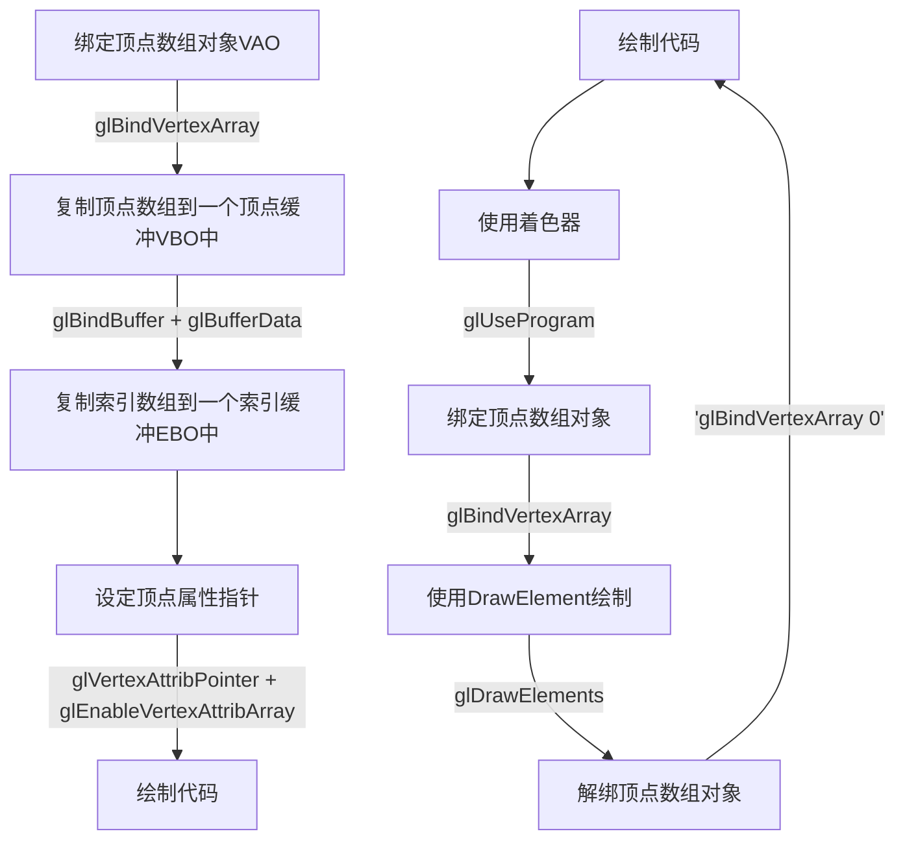

# 你好，三角形
> 顶点数组对象：Vertex Array Object，VAO
> 顶点缓冲对象：Vertex Buffer Object，VBO
> 索引缓冲对象：Element Buffer Object，EBO或Index Buffer Object，IBO

在OpenGL中，任何事物都在3D空间中，而屏幕和窗口却是2D像素数组，这导致OpenGL的大部分工作都是关于把3D坐标转变为适应你屏幕的2D像素。3D坐标转为2D坐标的处理过程是由OpenGL的==**图形渲染管线**==（Graphics Pipeline，大多译为管线，实际上指的是一堆原始图形数据途经一个输送管道，期间经过各种变化处理最终出现在屏幕的过程）管理的。图形渲染管线可以被划分为两个主要部分：第一部分把你的3D坐标转换为2D坐标，第二部分是把2D坐标转变为实际的有颜色的像素。

图形渲染管线接受一组3D坐标，然后把它们转变为你屏幕上的有色2D像素输出。图形渲染管线可以被划分为几个阶段，每个阶段将会把前一个阶段的输出作为输入。所有这些阶段都是高度专门化的（它们都有一个特定的函数），并且很容易并行执行。正是由于它们具有并行执行的特性，当今大多数显卡都有成千上万的小处理核心，它们在GPU上为每一个（渲染管线）阶段运行各自的小程序，从而在图形渲染管线中快速处理你的数据。这些小程序叫做==**着色器(Shader)**==。

有些着色器允许开发者自己配置，这就允许我们用自己写的着色器来替换默认的。这样我们就可以更细致地控制图形渲染管线中的特定部分了，而且因为它们运行在GPU上，所以它们可以给我们节约宝贵的CPU时间。OpenGL着色器是用==OpenGL着色器语言==(OpenGL Shading Language, GLSL)写成的。

下面是一个图形渲染管线的每个阶段的抽象展示：

首先，我们以数组的形式传递3个3D坐标作为图形渲染管线的输入，用来表示一个三角形，这个数组叫做顶点数据(Vertex Data)；

图形渲染管线的第一个部分是==顶点着色器==(Vertex Shader)，它把一个单独的顶点作为输入。顶点着色器主要的目的是把3D坐标转为另一种3D坐标（后面会解释），同时顶点着色器允许我们对顶点属性进行一些基本处理。

==图元装配==(Primitive Assembly)阶段将顶点着色器输出的所有顶点作为输入（如果是GL_POINTS，那么就是一个顶点），并将所有的点装配成指定图元的形状；本节例子中是一个三角形。

图元装配阶段的输出会传递给==几何着色器==(Geometry Shader)。几何着色器把图元形式的一系列顶点的集合作为输入，它可以通过产生新顶点构造出新的（或是其它的）图元来生成其他形状。例子中，它生成了另一个三角形。

几何着色器的输出会被传入==光栅化阶段==(Rasterization Stage)，这里它会把图元映射为最终屏幕上相应的像素，生成供片段着色器(Fragment Shader)使用的**片段(Fragment)**。在片段着色器运行之前会执行裁切(Clipping)。裁切会丢弃超出你的视图以外的所有像素，用来提升执行效率。
> OpenGL中的一个片段是OpenGL渲染一个像素所需的所有数据。

==片段着色器==的主要目的是计算一个像素的最终颜色，这也是所有OpenGL高级效果产生的地方。通常，片段着色器包含3D场景的数据（比如光照、阴影、光的颜色等等），这些数据可以被用来计算最终像素的颜色。

在所有对应颜色值确定以后，最终的对象将会被传到最后一个阶段，我们叫做==Alpha测试和混合==(Blending)阶段。这个阶段检测片段的对应的深度（和模板(Stencil)）值（后面会讲），用它们来判断这个像素是其它物体的前面还是后面，决定是否应该丢弃。这个阶段也会检查alpha值（alpha值定义了一个物体的透明度）并对物体进行混合(Blend)。所以，即使在片段着色器中计算出来了一个像素输出的颜色，在渲染多个三角形的时候最后的像素颜色也可能完全不同。

## 顶点输入
OpenGL是一个3D图形库，所以我们在OpenGL中指定的所有坐标都是3D坐标（x、y和z）。OpenGL不是简单地把所有的3D坐标变换为屏幕上的2D像素；OpenGL仅当3D坐标在3个轴（x、y和z）上都为-1.0到1.0的范围内时才处理它。所有在所谓的==标准化设备坐标==(Normalized Device Coordinates)范围内的坐标才会最终呈现在屏幕上（在这个范围以外的坐标都不会显示）。
由于我们希望渲染一个三角形，我们一共要指定三个顶点，每个顶点都有一个3D位置。我们会将它们以标准化设备坐标的形式（OpenGL的可见区域）定义为一个float数组。
```
float vertices[] = {
    -0.5f, -0.5f, 0.0f,
     0.5f, -0.5f, 0.0f,
     0.0f,  0.5f, 0.0f
};

```
将顶点数据送入顶点着色器，它会在GPU上创建内存用于储存我们的顶点数据，还要配置OpenGL如何解释这些内存，并且指定其如何发送给显卡。顶点着色器接着会处理我们在内存中指定数量的顶点。

我们通过==顶点缓冲对象==(Vertex Buffer Objects, VBO)管理这个内存，它会在GPU内存（通常被称为显存）中储存大量顶点。使用这些缓冲对象的好处是我们可以一次性的发送一大批数据到显卡上，而不是每个顶点发送一次。数据发送至显卡的内存中后，顶点着色器几乎能立即访问顶点。

顶点缓冲对象是我们在OpenGL教程中第一个出现的OpenGL对象。就像OpenGL中的其它对象一样，这个缓冲有一个独一无二的ID，所以我们可以使用`glGenBuffers`函数和一个缓冲ID生成一个VBO对象：
```
unsigned int VBO;
glGenBuffers(1, &VBO);
```
OpenGL有很多缓冲对象类型，顶点缓冲对象的缓冲类型是`GL_ARRAY_BUFFER`。我们可以使用`glBindBuffer`函数把新创建的缓冲绑定到`GL_ARRAY_BUFFER`目标上，在绑定后，我们使用的任何（`在GL_ARRAY_BUFFER`目标上的）缓冲调用都会用来配置当前绑定的缓冲(VBO)。然后我们可以调用`glBufferData`函数，它会把之前定义的顶点数据复制到缓冲的内存中。

## 顶点着色器
顶点着色器(Vertex Shader)是几个可编程着色器中的一个。如果我们打算做渲染的话，现代OpenGL需要我们至少设置一个顶点和一个片段着色器。
我们需要做的第一件事是用着色器语言GLSL(OpenGL Shading Language)编写顶点着色器，然后编译这个着色器，这样我们就可以在程序中使用它了。如下：
```GLSL
#version 330 core
layout (location = 0) in vec3 aPos;

void main()
{
    gl_Position = vec4(aPos.x, aPos.y, aPos.z, 1.0);
}
```
可以看到，GLSL看起来很像C语言。

## 编译着色器
使用C的字符串储存顶点着色器源码，为了能够让OpenGL使用它，我们必须在运行时动态编译它的源码。
我们首先要做的是创建一个着色器对象，注意还是用ID来引用的。所以我们储存这个顶点着色器为unsigned int，然后用glCreateShader创建这个着色器：
```
unsigned int vertexShader;
vertexShader = glCreateShader(GL_VERTEX_SHADER);
```
创建好着色器后，将源码附加到着色器上，然后编译，`glShaderSource`-->`glCompileShader`。

## 片段着色器
片段着色器(Fragment Shader)是第二个也是最后一个我们打算创建的用于渲染三角形的着色器。片段着色器所做的是计算像素最后的颜色输出。
编译片段着色器的过程与顶点着色器类似，只不过我们使用`GL_FRAGMENT_SHADER`常量作为着色器类型。

两个着色器现在都编译了，剩下的事情是把两个着色器对象链接到一个用来渲染的==着色器程序==(Shader Program)中。

## 着色器程序
着色器程序对象(Shader Program Object)是多个着色器合并之后并最终链接完成的版本。如果要使用刚才编译的着色器我们必须把它们==链接==(Link)为一个着色器程序对象，然后在渲染对象的时候激活这个着色器程序。已激活着色器程序的着色器将在我们发送渲染调用的时候被使用。

使用`glCreateProgram`函数创建一个程序，并返回新创建程序对象的ID引用。现在我们需要把之前编译的着色器附加到程序对象上，然后用`glLinkProgram`链接它们:
```
unsigned int shaderProgram;
shaderProgram = glCreateProgram();
glAttachShader(shaderProgram, vertexShader);
glAttachShader(shaderProgram, fragmentShader);
glLinkProgram(shaderProgram);
```
得到的结果就是一个程序对象，我们可以调用glUseProgram函数，用刚创建的程序对象作为它的参数，以激活这个程序对象。
对了，在把着色器对象链接到程序对象以后，记得删除着色器对象，我们不再需要它们了。

## 链接顶点属性
顶点着色器允许我们指定任何以顶点属性为形式的输入。这使其具有很强的灵活性的同时，它还的确意味着我们必须手动指定输入数据的哪一个部分对应顶点着色器的哪一个顶点属性。所以，我们必须在渲染前指定OpenGL该如何解释顶点数据。
在有顶点数据信息的基础上，我们可以使用`glVertexAttribPointer`函数告诉OpenGL该如何解析顶点数据。
```
glVertexAttribPointer(0, 3, GL_FLOAT, GL_FALSE, 3 * sizeof(float), (void*)0);
glEnableVertexAttribArray(0);
```

现在我们已经定义了OpenGL该如何解释顶点数据，我们现在应该使用`glEnableVertexAttribArray`，以顶点属性位置值作为参数，启用顶点属性；顶点属性默认是禁用的。自此，所有东西都已经设置好了。
我们使用一个顶点缓冲对象将顶点数据初始化至缓冲中，建立了一个顶点和一个片段着色器，并告诉了OpenGL如何把顶点数据链接到顶点着色器的顶点属性上。

在OpenGL中绘制一个物体，代码会像是这样：
```
// 0. 复制顶点数组到缓冲中供OpenGL使用
glBindBuffer(GL_ARRAY_BUFFER, VBO);
glBufferData(GL_ARRAY_BUFFER, sizeof(vertices), vertices, GL_STATIC_DRAW);
// 1. 设置顶点属性指针
glVertexAttribPointer(0, 3, GL_FLOAT, GL_FALSE, 3 * sizeof(float), (void*)0);
glEnableVertexAttribArray(0);
// 2. 当我们渲染一个物体时要使用着色器程序
glUseProgram(shaderProgram);
// 3. 绘制物体
someOpenGLFunctionThatDrawsOurTriangle();
```
每当我们绘制一个物体的时候都必须重复这一过程。这看起来可能不多，但是如果有超过5个顶点属性，上百个不同物体呢（这其实并不罕见）。绑定正确的缓冲对象，为每个物体配置所有顶点属性很快就变成一件麻烦事。

## 顶点数组对象
==顶点数组对象==(Vertex Array Object, VAO)可以像顶点缓冲对象那样被绑定，任何随后的顶点属性调用都会储存在这个VAO中。这样的好处就是，当配置顶点属性指针时，你只需要将那些调用执行一次，之后再绘制物体的时候只需要绑定相应的VAO就行了。
> OpenGL的核心模式要求我们使用VAO，所以它知道该如何处理我们的顶点输入。如果我们绑定VAO失败，OpenGL会拒绝绘制任何东西。

一个顶点数组对象会储存以下这些内容：
- `glEnableVertexAttribArray`和`glDisableVertexAttribArray`的调用。
- 通过`glVertexAttribPointer`设置的顶点属性配置。
- 通过`glVertexAttribPointer`调用与顶点属性关联的顶点缓冲对象。

创建一个VAO和创建一个VBO很类似：
```
unsigned int VAO;
glGenVertexArrays(1, &VAO);
```
要想使用VAO，要做的只是使用`glBindVertexArray`绑定VAO。从绑定之后起，我们应该绑定和配置对应的VBO和属性指针，之后解绑VAO供之后使用。当我们打算绘制一个物体的时候，我们只要在绘制物体前简单地把VAO绑定到希望使用的设定上就行了。
```
// ..:: 初始化代码（只运行一次 (除非你的物体频繁改变)） :: ..
// 1. 绑定VAO
glBindVertexArray(VAO);
// 2. 把顶点数组复制到缓冲中供OpenGL使用
glBindBuffer(GL_ARRAY_BUFFER, VBO);
glBufferData(GL_ARRAY_BUFFER, sizeof(vertices), vertices, GL_STATIC_DRAW);
// 3. 设置顶点属性指针
glVertexAttribPointer(0, 3, GL_FLOAT, GL_FALSE, 3 * sizeof(float), (void*)0);
glEnableVertexAttribArray(0);

[...]

// ..:: 绘制代码（渲染循环中） :: ..
// 4. 绘制物体
glUseProgram(shaderProgram);
glBindVertexArray(VAO);
someOpenGLFunctionThatDrawsOurTriangle();
```
> Important: 先绑定VAO，再绑定VBO

## 我们一直期待的三角形
要想绘制我们想要的物体，OpenGL给我们提供了glDrawArrays函数，它使用当前激活的着色器，之前定义的顶点属性配置，和VBO的顶点数据（通过VAO间接绑定）来绘制图元。
```
glUseProgram(shaderProgram);
glBindVertexArray(VAO);
glDrawArrays(GL_TRIANGLES, 0, 3);
```
`glDrawArrays`函数第一个参数是我们打算绘制的OpenGL图元的类型。由于我们在一开始时说过，我们希望绘制的是一个三角形，这里传递`GL_TRIANGLES`给它。

## 索引缓冲对象
==索引缓冲对象==(Element Buffer Object，EBO，也叫Index Buffer Object，IBO)。要解释索引缓冲对象的工作方式最好还是举个例子：假设我们不再绘制一个三角形而是绘制一个矩形。我们可以绘制两个三角形来组成一个矩形（OpenGL主要处理三角形）。这会生成下面的顶点的集合：
```
float vertices[] = {
    // 第一个三角形
    0.5f, 0.5f, 0.0f,   // 右上角
    0.5f, -0.5f, 0.0f,  // 右下角
    -0.5f, 0.5f, 0.0f,  // 左上角
    // 第二个三角形
    0.5f, -0.5f, 0.0f,  // 右下角
    -0.5f, -0.5f, 0.0f, // 左下角
    -0.5f, 0.5f, 0.0f   // 左上角
};
```
可以看到，有几个顶点叠加了。我们指定了`右下角`和`左上角`两次！一个矩形只有4个而不是6个顶点，这样就产生50%的额外开销。当我们有包括上千个三角形的模型之后这个问题会更糟糕，这会产生一大堆浪费。更好的解决方案是只储存不同的顶点，并设定绘制这些顶点的顺序。这样子我们只要储存4个顶点就能绘制矩形了，之后只要指定绘制的顺序就行了。

索引缓冲对象的工作方式正是这样的。和顶点缓冲对象一样，EBO也是一个缓冲，它专门储存索引，OpenGL调用这些顶点的索引来决定该绘制哪个顶点。所谓的==索引绘制==(Indexed Drawing)正是我们问题的解决方案。首先，我们先要定义（不重复的）顶点，和绘制出矩形所需的索引：
```
float vertices[] = {
    0.5f, 0.5f, 0.0f,   // 右上角
    0.5f, -0.5f, 0.0f,  // 右下角
    -0.5f, -0.5f, 0.0f, // 左下角
    -0.5f, 0.5f, 0.0f   // 左上角
};

unsigned int indices[] = { // 注意索引从0开始! 
    0, 1, 3, // 第一个三角形
    1, 2, 3  // 第二个三角形
};
```
你可以看到，当时用索引的时候，我们只定义了4个顶点，而不是6个。下一步我们需要创建索引缓冲对象：
```
unsigned int EBO;
glGenBuffers(1, &EBO);
```

与VBO类似，我们先绑定EBO然后用`glBufferData`把索引复制到缓冲里。同样，和VBO类似，我们会把这些函数调用放在绑定和解绑函数调用之间，只不过这次我们把缓冲的类型定义为`GL_ELEMENT_ARRAY_BUFFER`。
```
glBindBuffer(GL_ELEMENT_ARRAY_BUFFER, EBO);
glBufferData(GL_ELEMENT_ARRAY_BUFFER, sizeof(indices), indices, GL_STATIC_DRAW);
```

要注意的是，我们传递了`GL_ELEMENT_ARRAY_BUFFER`当作缓冲目标。最后一件要做的事是用`glDrawElements`来替换`glDrawArrays`函数，来指明我们从索引缓冲渲染。使用`glDrawElements`时，我们会使用当前绑定的索引缓冲对象中的索引进行绘制。
```
glBindBuffer(GL_ELEMENT_ARRAY_BUFFER, EBO);
glDrawElements(GL_TRIANGLES, 6, GL_UNSIGNED_INT, 0);
```
第一个参数指定了我们绘制的模式，这个和`glDrawArrays`的一样。第二个参数是我们打算绘制顶点的个数，这里填6，也就是说我们一共需要绘制6个顶点。第三个参数是索引的类型，这里是`GL_UNSIGNED_INT`。最后一个参数里我们可以指定EBO中的偏移量（或者传递一个索引数组，但是这是当你不在使用索引缓冲对象的时候），但是我们会在这里填写0。

`glDrawElements`函数从当前绑定到GL_ELEMENT_ARRAY_BUFFER目标的EBO中获取索引。这意味着我们**必须在每次要用索引渲染一个物体时绑定相应的EBO**，这还是有点麻烦。不过[[你好，三角形..#顶点数组对象|顶点数组对象]]同样可以保存索引缓冲对象的绑定状态。VAO绑定时正在绑定的索引缓冲对象会被保存为VAO的元素缓冲对象。绑定VAO的同时也会自动绑定EBO。
> 当目标是`GL_ELEMENT_ARRAY_BUFFER`的时候，VAO会储存`glBindBuffer`的函数调用。这也意味着它也会储存解绑调用，所以确保你没有在解绑VAO之前解绑索引数组缓冲，否则它就没有这个EBO配置了。

使用VAO、VBO、EBO共同工作时，流程如下

代码看起来像这样：
```
// ..:: 初始化代码 :: ..
// 1. 绑定顶点数组对象
glBindVertexArray(VAO);
// 2. 把我们的顶点数组复制到一个顶点缓冲中，供OpenGL使用
glBindBuffer(GL_ARRAY_BUFFER, VBO);
glBufferData(GL_ARRAY_BUFFER, sizeof(vertices), vertices, GL_STATIC_DRAW);
// 3. 复制我们的索引数组到一个索引缓冲中，供OpenGL使用
glBindBuffer(GL_ELEMENT_ARRAY_BUFFER, EBO);
glBufferData(GL_ELEMENT_ARRAY_BUFFER, sizeof(indices), indices, GL_STATIC_DRAW);
// 4. 设定顶点属性指针
glVertexAttribPointer(0, 3, GL_FLOAT, GL_FALSE, 3 * sizeof(float), (void*)0);
glEnableVertexAttribArray(0);

[...]

// ..:: 绘制代码（渲染循环中） :: ..
glUseProgram(shaderProgram);
glBindVertexArray(VAO);
glDrawElements(GL_TRIANGLES, 6, GL_UNSIGNED_INT, 0)
glBindVertexArray(0);
```

